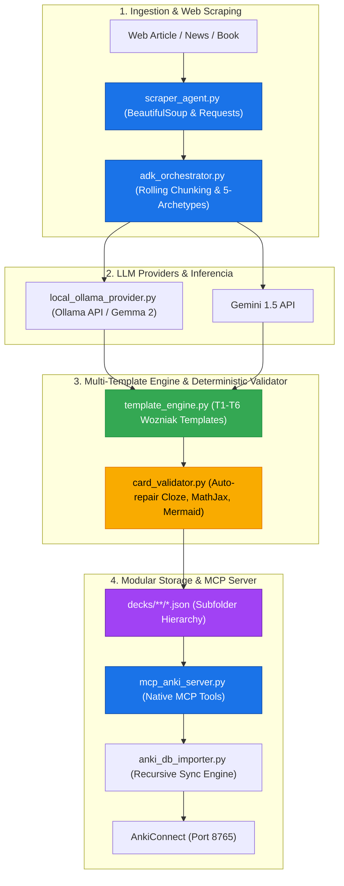

# Anki Tools & MCP Wrapper Architecture

This repository provides a decoupled, modular, and AI-agent-ready system for creating, managing, validating, and synchronizing high-engagement study decks into a local Anki installation via [AnkiConnect](https://foosoft.net/projects/anki-connect/).

---

## System Architecture Overview



---

## Key Modules & Core Technical Details

### 1. Decentralized Subfolder Deck Architecture (`decks/`)
- All decks are decoupled from monolithic files into nested subfolders under `decks/`.
- The double-colon notation in Anki (`Pillar::Category::Subcategory::DeckName`) maps directly to disk paths (`decks/Pillar/Category/Subcategory/DeckName.json`).
- **Evolving Learning Path Principle**: Every deck is organized as a dynamic Learning Path. Subcategories are explicitly structured to allow intuitive progression from **Foundations (Fundamentos)** -> **Intermediate (Intermedio)** -> **Advanced Technical Topics (Temas Técnicos Avanzados)**. Agents are empowered to create, refine, or adjust subcategories whenever logically justified to maintain smooth learning progression.
- Automatically tracks metadata and deck counts in `decks/index.json`.

### 2. Multi-Template Engine (`template_engine.py`)
Implements 6 specialized templates based on Dr. Piotr Wozniak's 20 Rules of Formulating Knowledge:
- **T1_Cloze:** Atomic Cloze Deletion for vocabulary and key concepts.
- **T2_DualCoding:** Dual-Coding Theory with HTML/Mermaid visual flowcharts in card back.
- **T3_CodeSnippet:** Code patterns, algorithms, and CLI commands with syntax highlighting.
- **T4_Scenario:** Real-world dialogue, soft skills, and professional negotiation phrases.
- **T5_MathJax:** LaTeX/MathJax formulas and physical law variable breakdowns.
- **T6_Quiz:** Active recall multiple-choice questions with rationales.

### 3. Deterministic Syntax Validator & Auto-Repair (`card_validator.py`)
Guarantees robust operation when using local LLMs (Ollama / Gemma 2 / Llama 3) by enforcing auto-repair rules:
- **Mermaid Auto-Repair:** Fixes malformed arrows (`->|label|` -> `-->|label|`) and quotes node labels with special characters (`A[Label (info)]` -> `A["Label (info)"]`).
- **Cloze Tag Repair:** Fixes unclosed braces (`{{c1::text}` -> `{{c1::text}}`).
- **MathJax Matching:** Validates balance of `\[...\]` and `\(...\)` delimiters.

### 4. ADK Document Orchestrator & Scraper (`adk_orchestrator.py` & `scraper_agent.py`)
- **Web Scraping:** `scraper_agent.py` fetches web URLs, strips boilerplate HTML (ads, nav, scripts), and extracts readable text.
- **Map-Reduce Rolling Window:** `adk_orchestrator.py` chunks long books/documents into 4,000 character rolling windows to manage context limits.
- **5-Archetype Guardrails:** Applies Scholar, Analyst, Architect, Producer, Advisor procedural steps to ensure single-fact atomic cards.

### 5. Native MCP Server (`mcp_anki_server.py`)
Exposes tools for AI Agents and LLMs:
- `mcp_anki_list_decks()`: Explores all deck JSON files and index.
- `mcp_anki_read_deck(deck_name)`: Reads specific deck card entries.
- `mcp_anki_create_card(template_type, data)`: Generates validated cards.
- `mcp_anki_scrape_and_generate(url, deck_name)`: Triggers end-to-end web ingestion.
- `mcp_anki_sync()`: Triggers 2-way sync with AnkiConnect Desktop.

### 6. Recursive Importer (`anki_db_importer.py`)
- Traverses `decks/**/*.json` recursively using `load_all_cards()`.
- Synchronizes cards, fields, and tags with AnkiConnect (port 8765).

---

## How to Run

1. **Migrate Monolithic DB to Decks Tree:**
   ```bash
   python3 migrate_monolith_to_decks.py
   ```

2. **Scrape Web Article & Auto-Generate Decks:**
   ```bash
   python3 scraper_agent.py https://en.wikipedia.org/wiki/Spaced_repetition News_Scraped::SRS_Learning
   ```

3. **Run MCP Server CLI:**
   ```bash
   python3 mcp_anki_server.py list_decks
   ```

4. **Sync with Anki Desktop:**
   * Open Anki Desktop with AnkiConnect installed.
   * Run:
     ```bash
     python3 anki_db_importer.py
     ```
