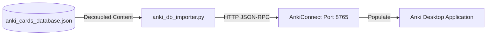

# Anki Tools Project Architecture

This project provides a decoupled, scalable architecture to manage and import high-engagement study decks into a local Anki installation via the [AnkiConnect](https://foosoft.net/projects/anki-connect/) add-on.

---

## Core System Architecture

To make card updates traceable, scalable, and easy to expand, the project utilizes a **decentralized content architecture**:



1. **Decoupled Content (`anki_cards_database.json`)**: All card contents, scenarios, decks, tags, and translations are defined in a central JSON database.
2. **Database Importer (`anki_db_importer.py`)**: A robust two-way sync engine that compares the JSON database with existing notes in Anki (checking fields and tags case-insensitively). It only updates modified notes and adds new ones, preventing any duplicate cards.
3. **Legacy Scripts (Archived)**: Old scripts (`generate_scenarios.py`, `generate_ai_path.py`, `generate_books_path.py`, `add_business_scenarios.py`, `generate_languages_path.py`, and `generate_philosophy_path.py`) remain available in the repository as references.

---

## Supported Files & Tools
- `/docs`: Project documentation and architecture details.
- `/anki_cards_database.json`: Central content repository containing all 650 cards.
- `/anki_db_importer.py`: Main importer script with two-way sync engine.
- `/clean_anki_duplicates.py`: Script to identify and clean up duplicate notes in Anki.
- `/ingest_languages.py`: Recursive crawler that automatically parses vocabulary and phonetics rules from Google Drive and populates the database.
- `/anki_helper.py`: Legacy CLI management tool.


---

## How to run
1. Open the Anki desktop application.
2. Run the database importer:
   ```powershell
   python anki_db_importer.py
   ```
