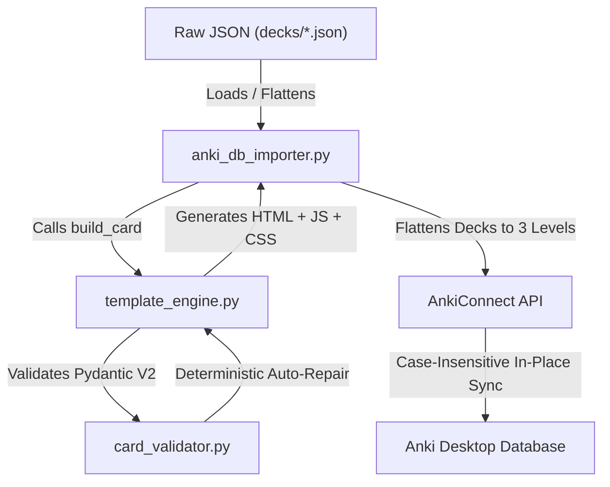

# Anki Card Quality Standards, Template Catalog, and Topic Creation Guide

This document is the authoritative guide for creating, validating, updating, and synchronizing flashcards in the `anki-tools` ecosystem. It outlines the system architecture, explains where to locate existing topics, describes the 16 pedagogical templates (T1 to T16), and provides a copy-paste prompt for external LLM generation in AI Studio.

---

## 1. System Architecture & Reusability

The Anki ADK system operates on a separation of concerns between raw content files, schema validation, dynamic template compiling, and synchronization.



### 1.1 Folder Tree vs. Anki Decks
- **Filesystem (4 levels of depth)**: Cards are organized on disk using folders matching the **6 Pillars**:
  - `01_Cloud_and_Infrastructure`
  - `02_AI_and_Data_Science`
  - `03_Languages`
  - `04_Social_and_Humanities`
  - `05_Soft_Skills_and_Leadership`
  - `06_Business_and_Productivity`
  - *Example Filepath*: `decks/03_Languages/English/Phonetics/connected_speech.json`
- **Anki Desktop (3 levels of depth)**: To prevent truncation on mobile devices, `anki_db_importer.py` strips the Pillar prefix during sync, flattening the deck hierarchy to 3 levels:
  - *Example Anki Deck*: `English::Phonetics::connected_speech`

### 1.2 Note Identity & Sync Matching
- **Primary Key**: Synchronization uses a case-insensitive matching key based on the normalized `text` (or `prompt` for Speaking) string.
- **Review History Preservation**: If a card is relocated to a different deck or its fields are updated, the importer updates the note in-place without recreating it. This preserves ease factors, intervals, card status, and review histories.

### 1.3 State Persistence Scripting
- Active tabs and click-to-reveal states are preserved between the card Front and Back reviews using `sessionStorage` in the browser DOM.
- Tab names are saved under `active_tab_{card_id}`, and Mermaid click reveals use node DOM indexes under `revealed_nodes_{card_id}`.

---

## 2. Topic Creation & Avoiding Duplicates

### 2.1 Locating Existing Decks
Before creating a new topic, always check the global index:
- **Index File**: [decks/index.json](file:///c:/Users/jesus/anki/decks/index.json)
  This file tracks `total_cards`, `total_decks`, and lists the logical path and card count for every JSON database file.
- **Monolith Database**: `anki_cards_database.json`
  This contains the merged array of all cards currently indexed in the workspace.

### 2.2 Duplication Audit & Verification
- Check if a concept already has cards by searching in `anki_cards_database.json`.
- The synchronization engine automatically drops duplicate cards that share the same deck and normalized text/prompt value, warning you in the console:
  `[-] Warning: Ignored duplicate card in JSON database...`

### 2.3 Proactive Corrections
> [!IMPORTANT]
> If an LLM or developer identifies incorrect details, typos, outdated practices, or formatting errors in existing cards during research, they **must proactively update the source JSON file** under `decks/` instead of ignoring it. The sync engine will automatically propagate these changes to Anki Desktop on the next run.

---

## 3. Template Catalog & Use Cases (T1 to T16)

Every card in the database must use one of the following 16 templates. They enforce atomic learning and visual association:

| Template ID | Primary Use Case | Required Fields |
| :--- | :--- | :--- |
| **T1_Cloze** | Core vocabulary, technical terms, and simple definitions. | `text`, `explanation`, `spanish` |
| **T2_DualCoding** | Systems, flows, and architectures using click-to-reveal Mermaid SVGs. | `concept`, `mermaid_code`, `explanation`, `spanish` |
| **T3_CodeSnippet** | CLI commands, syntax structures, algorithms, and code blocks. | `title`, `code_block`, `language`, `explanation` |
| **T4_Scenario** | Soft skills, negotiations, and customer support phrases. | `scenario`, `target_phrase`, `usage`, `spanish` |
| **T5_MathJax** | Latex math/physics equations and variables. | `concept`, `formula_latex`, `variable_breakdown` |
| **T6_Quiz** | Multiple choice questions for certification prep. | `question`, `options`, `correct_option`, `rationale` |
| **T7_Pronunciation** | Connected speech rules and phonological drills. | `rule_name`, `formal_phrase`, `fast_pronunciation`, `explanation`, `spanish` |
| **T8_MinimalPair** | Phoneme discrimination table grids. | `phoneme_a`, `phoneme_b`, `ipa_a`, `ipa_b`, `word_pairs`, `muscle_tip`, `language` |
| **T9_ListeningChunk** | Connected speech dictation gaps. | `full_transcript`, `connected_form`, `gap_text`, `rules_applied`, `language` |
| **T10_ReadingPatternDrill** | Grapheme-to-phoneme drills. | `language`, `script_note`, `grapheme_pattern`, `word_examples`, `phoneme_target` |
| **T11_ExecutivePitch** | Leadership shadowing and pause/tone mappings. | `speaker`, `source_context`, `transcript_excerpt`, `pitch_analysis`, `pause_map`, `shadowing_script`, `leadership_technique` |
| **T12_SpeakingPractice** | Interactive speaking drills with model audios. | `prompt`, `explanation`, `usage`, `spanish`, `model_audio_url`, `practice_url` |
| **T13_MnemonicPalace** | Visual-spatial memory anchors in Loci. | `concept`, `explanation`, `spanish`, `palace_name`, `locus_stop`, `mnemonic_scene` |
| **T14_PegNumber** | Number association using the Major phonetic system. | `concept`, `number`, `phonetic_code`, `peg_word`, `visual_scene` |
| **T15A_FeynmanAnalogy** | Simplifying complex technical concepts with metaphors. | `concept`, `layperson_explanation`, `metaphor_analogy`, `explanation` |
| **T15B_FeynmanScenario** | Applied generation challenges to prove understanding. | `concept`, `generation_challenge`, `explanation` |
| **T16_NameFace** | Facial feature association and profile cards. | `person_name`, `distinguishing_feature`, `substitute_word_or_image`, `association_scene`, `contribution` |

---

## 4. Advanced Template Schemas (T13 - T16)

These templates support mnemonic systems, analogies, and name-face recognition. They utilize tabbed panel wrapping (`build_tabs`) and match game assets.

### T13: Mnemonic Palace
Used to anchor technical concepts (ports, architecture layers, design patterns) to a physical locus in a visual memory palace.

```json
{
  "deck": "Productivity_and_Habits::Methodology::Productivity_And_Habits",
  "template": "T13_MnemonicPalace",
  "metadata": {
    "difficulty": "intermediate",
    "tags": ["mnemonic_palace", "memory_techniques"]
  },
  "content": {
    "concept": "Loci Method",
    "explanation": "Visual maps in physical locations.",
    "spanish": "Método de Loci"
  },
  "mnemonics": {
    "palace_name": "Living Room",
    "locus_stop": "01_TV",
    "mnemonic_scene": "A huge glowing TV displaying a brain.",
    "peg_word": "",
    "phonetic_code": ""
  },
  "interactivity": {
    "analogy": "It is like marking coordinates on a map."
  }
}
```

### T14: Peg Number
Used for remembering numeric technical variables (e.g. ports, status codes, algorithms) by mapping digits to phonetic sounds (Major System).

```json
{
  "deck": "Productivity_and_Habits::Methodology::Productivity_And_Habits",
  "template": "T14_PegNumber",
  "metadata": {
    "difficulty": "intermediate",
    "tags": ["peg_system", "memory_techniques"]
  },
  "content": {
    "concept": "Port 80 (HTTP)",
    "number": "80",
    "explanation": "Standard port for unencrypted web traffic.",
    "spanish": "Puerto 80 (HTTP)"
  },
  "mnemonics": {
    "palace_name": "",
    "locus_stop": "",
    "mnemonic_scene": "",
    "peg_word": "Fez",
    "phonetic_code": "8 = F, 0 = S/Z"
  },
  "interactivity": {
    "visual_scene": "A server wearing a red Fez hat."
  }
}
```

### T15A: Feynman Analogy
Uses a tabbed component splitting the concept description into a simple layperson explanation, a metaphor, and technical details.

```json
{
  "deck": "Productivity_and_Habits::Methodology::Productivity_And_Habits",
  "template": "T15A_FeynmanAnalogy",
  "metadata": {
    "difficulty": "intermediate",
    "tags": ["feynman_method", "analogy"]
  },
  "content": {
    "concept": "API (Application Programming Interface)",
    "layperson_explanation": "A way for two programs to talk to each other.",
    "metaphor_analogy": "A waiter taking your order to the kitchen.",
    "explanation": "A set of protocols and definitions that allows software integration."
  }
}
```

### T15B: Feynman Scenario
Challenges the student to explain or resolve an applied problem using the concept.

```json
{
  "deck": "Productivity_and_Habits::Methodology::Productivity_And_Habits",
  "template": "T15B_FeynmanScenario",
  "metadata": {
    "difficulty": "intermediate",
    "tags": ["feynman_method", "challenge"]
  },
  "content": {
    "concept": "Pub/Sub Messaging",
    "generation_challenge": "Design an update pipeline for a mobile app where 10,000 users need real-time flight notifications.",
    "explanation": "Configure a central message broker where the service publishes updates to a topic, and subscribers pull asynchronously."
  }
}
```

### T16: Name-Face
Associates a face, portrait image, or distinguishing trait with a person's name and contributions.

```json
{
  "deck": "Productivity_and_Habits::Methodology::Productivity_And_Habits",
  "template": "T16_NameFace",
  "metadata": {
    "difficulty": "intermediate",
    "tags": ["name_face", "memory_techniques"]
  },
  "content": {
    "person_name": "Piotr Wozniak",
    "distinguishing_feature": "Long gray hair and circular glasses.",
    "substitute_word_or_image": "Wozniak (sounds like Wizard)",
    "association_scene": "A wizard sitting on a giant letter 'S' (SuperMemo) creating memory spells.",
    "contribution": "Developed the SM-2 algorithm for spaced repetition."
  }
}
```

---

## 5. Google AI Studio Copy-Paste Generator Prompt

Copy the block below and paste it into Google AI Studio or any external LLM to generate valid Anki card arrays.

```text
You are an expert card creator for the Anki ADK system.
Generate an array of JSON objects containing flashcards according to the nested schema.

RULES:
1. Atomicity: Each card must test exactly ONE fact.
2. Structure: Output must be a valid JSON array of objects. Do not wrap in markdown unless requested.
3. Templates: Choose from:
   - T1_Cloze: text (with exactly one {{c1::cloze}}), explanation, spanish.
   - T2_DualCoding: concept, mermaid_code (valid syntax, arrows must be -->), explanation, spanish.
   - T3_CodeSnippet: title, code_block, language, explanation.
   - T4_Scenario: scenario, target_phrase, usage (HTML format), spanish.
   - T5_MathJax: concept, formula_latex (use \\( for inline, \\[ for block), variable_breakdown.
   - T6_Quiz: question, options (array of 3-4 items), correct_option, rationale.
   - T13_MnemonicPalace: concept, explanation, spanish, palace_name, locus_stop, mnemonic_scene.
   - T14_PegNumber: concept, number, explanation, spanish, peg_word, phonetic_code, visual_scene (in interactivity).
   - T15A_FeynmanAnalogy: concept, layperson_explanation, metaphor_analogy, explanation.
   - T15B_FeynmanScenario: concept, generation_challenge, explanation.
   - T16_NameFace: person_name, distinguishing_feature, substitute_word_or_image, association_scene, contribution.

Hierarchical Deck Paths:
Must use the 4-level deep hierarchy: Pillar::Category::Subcategory::DeckName
Choose from the 6 Pillars:
- 01_Cloud_and_Infrastructure
- 02_AI_and_Data_Science
- 03_Languages
- 04_Social_and_Humanities
- 05_Soft_Skills_and_Leadership
- 06_Business_and_Productivity

JSON SCHEMA STRUCTURE FOR EACH ITEM:
{
  "deck": "Pillar::Category::Subcategory::DeckName",
  "template": "T1_Cloze" | "T2_DualCoding" | "T3_CodeSnippet" | "T4_Scenario" | "T5_MathJax" | "T6_Quiz" | "T13_MnemonicPalace" | "T14_PegNumber" | "T15A_FeynmanAnalogy" | "T15B_FeynmanScenario" | "T16_NameFace",
  "metadata": {
    "difficulty": "beginner" | "intermediate" | "advanced",
    "tags": ["tag1", "tag2"]
  },
  "content": {
    // Template specific fields go here
    // e.g. T1: {"text": "...", "explanation": "...", "spanish": "..."}
  },
  "mnemonics": { // Required for T13 and T14
    "palace_name": "",
    "locus_stop": "",
    "mnemonic_scene": "",
    "peg_word": "",
    "phonetic_code": ""
  },
  "interactivity": { // Required for T14, T15, T16
    "analogy": "",
    "interactive_mermaid": "",
    "match_game_data": null
  }
}

TASK:
[Describe your topic, material, or text to extract cards from here]
```

### How to Apply Generated JSON
1. Paste the generated JSON array into the target file inside `decks/` (e.g. `decks/06_Business_and_Productivity/Productivity/Habits/habits.json`).
2. Run the deterministic validator:
   ```powershell
   python anki_adk_hub.py validate
   ```
3. Sync the cards directly to Anki Desktop:
   ```powershell
   python anki_adk_hub.py sync
   ```
